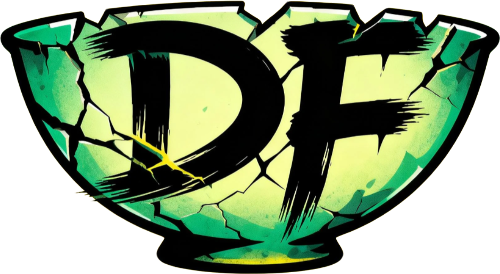
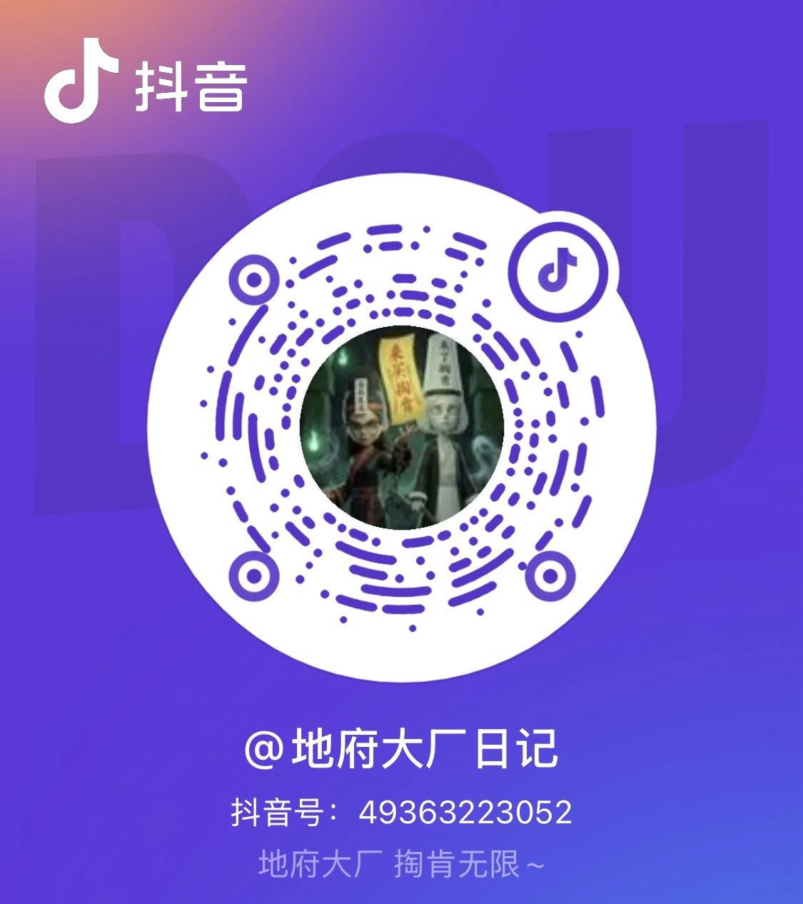

# Netherworld Gate · 地府接引司

> **Flat monthly fee · Unlimited tokens · Unlimited calls** · One key, every model

  

  <b>🔮 Every client · Every model · One gate</b>

  <a href="https://df.dawnloadai.com:8443"><b>Try Live Demo</b></a>

---

## 📜 Announcements

> **⚡ GLM-5.1 coming soon** — Private inference on our self-hosted Ascend 910B cluster. No rate limits, no truncation, no queue.
>
> **🌍 Global edge nodes coming soon** — Cross-region routing, nearest-point access, zero transpacific lag.

---

## 📊 Netherworld in Numbers (as of 2026-04-20)

> We opened the gates on **2026-04-13**. In just **8 days**:

| 🧑‍🌾 Users | 🔑 Active Keys | 📡 Requests | 🔥 Tokens Served |
|:---:|:---:|:---:|:---:|
| **1,600+** | **1,700+** | **2.5M+** | **160B+** |

> Averaging **300k+ requests/day** across **GLM-5.1 / GLM-5 / GLM-4.7 / MiniMax M2.7 High-speed** channels.

---

## 💰 Pricing · Flat, Unlimited

> One price, unlimited tokens, unlimited calls. Auto-routed from a single token.

| Channel | Weekly · 7d | Monthly · 30d | Best for |
|:-------:|:-----------:|:-------------:|:---------|
| ⚡ **MiniMax M2.7 · High-speed** | **¥3** | **¥10** | Daily chat · writing · light coding |
| 🔥 **GLM-5.1 · Flagship** | **¥20** | **¥39.9** | Heavy coding · long context · reasoning |

- 💡 **Explore**: MiniMax monthly at **¥10** — less than a bubble tea
- 🚀 **Go pro**: GLM-5.1 monthly at **¥39.9** — under half the price of any single Claude / ChatGPT sub
- 🎯 **Both**: stack them, one token auto-routes to the right channel

🎁 Welcome coupon · Referral rewards · Redeem codes · Pay-as-you-go fallback — see [PRICING.md](./PRICING.md).

👉 **Subscribe now: [https://df.dawnloadai.com:8443](https://df.dawnloadai.com:8443)**

---

## 🏯 About Netherworld Gate

**Netherworld Gate** is an all-in-one AI API hub designed for the age of abundant models.

Stop juggling subscriptions from OpenAI, Anthropic, Google and Zhipu. Stop managing a drawer full of API keys. **One token, every model.**

We aggregate subscription quota from the world's leading AI providers into a single, unified calling endpoint:

- **Coding?** Switch freely between Claude, GPT, Gemini
- **Long context?** Auto-routed to the account with the biggest window
- **Budget-conscious?** Pay per token — down to the cent
- **Tool enthusiast?** Our **DFSwitch** desktop app injects your key into every AI client with one click

---

## ✨ Why Netherworld?

### 🚀 Unlimited Monthly · Use It All

**One flat price, unlimited everything for a month.** No token meters, no per-call fees, no model-switching penalties.

- ❌ Others: pay per token — one long Claude session costs real money
- ❌ Others: Cursor + Claude + ChatGPT subscriptions stack into $50+/month
- ✅ **Netherworld: one monthly pass, all of the above included.** When the month ends, renew. No guilt, no anxiety.

### 💎 One Key, Every Client

One API key, compatible with **OpenAI / Anthropic / Gemini** protocols. Point your existing tools at our endpoint — no code changes.

### 🧠 Every Model

- **Claude** (Sonnet / Opus / Haiku)
- **ChatGPT** (GPT-4o / o1 / o3)
- **Gemini** (1.5 Pro / 2.0 Flash)
- **GLM** (GLM-4 / GLM-5.1 soon)
- More coming every week

### ⚡ Self-Hosted Compute

**GLM-5.1 on Ascend 910B** — private inference on our own hardware. Data sovereignty for enterprises and compliance-sensitive users.

### 🎯 Smart Scheduling

- **Context-aware routing**: 80k+ conversations land on high-capacity accounts automatically
- **Sticky sessions**: Same conversation, same account — maximizes prompt cache hits
- **Automatic failover**: Upstream hiccups are handled invisibly
- **Fair queuing**: Peak-hour surges stay smooth

### 🖥️ DFSwitch Desktop

No more editing shell rc files. No more exporting env vars. Sign in once, click once — your key is written into:

| 🤖 Claude Code | 📝 Cursor | 💬 Chatbox | 🍒 Cherry Studio |
| -- | -- | -- | -- |
| 🌟 Gemini CLI | ⚙️ OpenCode | 🦞 OpenClaw | ➕ More… |

**Local-first** — credentials never leave your device.

### 💰 Flat Monthly — No Guesswork

**The core plan is simple: one price, used however much you want.**

- ✅ **Monthly Unlimited** — unlimited tokens, unlimited calls, unlimited model switching
- 🎁 **First-month discount** for new users
- 🎟️ **Redeem codes** — gifts, team procurement, campaigns
- 👯 **Referrals** — both sides earn credit
- 🆘 **Pay-as-you-go fallback** — available if you prefer per-token billing

---

## 🌟 Who uses it?

- **Indie developers** — one token replaces three separate subscriptions
- **Small teams** — unified usage visibility, one monthly invoice
- **Students** — pay-as-you-go under the price of any single subscription
- **Tool enthusiasts** — DFSwitch ends the era of manual config editing

---

## 🗺️ Roadmap

| Stage | Milestone | Status |
|-------|-----------|--------|
| Q1 | Multi-model aggregation, OAuth pooling, billing | ✅ Live |
| Q1 | Subscriptions, redeem codes, referrals | ✅ Live |
| Q2 | Long-context smart routing | ✅ Live |
| Q2 | DFSwitch landing page | ✅ Live |
| **Q2** | **GLM-5.1 on self-hosted 910B** | 🔥 Coming soon |
| **Q2** | **Global edge nodes** | 🌍 Coming soon |
| Q2 | DFSwitch Windows / macOS GA | 🔧 Polishing |
| Q3 | Enterprise SLA, priority support | 📋 Planned |
| Q3 | DFSwitch Linux | 📋 Planned |

---

## 🎨 Brand Story

**Netherworld** is not about the afterlife — it is a **gateway**.

We see scattered AI APIs as spirits wandering across different realms: some in Silicon Valley, some in Mountain View, some in Zhongguancun. Each realm has its own seals, passwords and travel permits.

The **Gate** exists to abstract all of that away. **One token. The Netherworld witnesses. A hundred models answer.**

Ink-green backdrop, amber accents, scroll-like announcements — we wrap a pragmatic engineering product in a distinct oriental-fantasy aesthetic, so that using AI feels a little more ritualistic.

> *Enter with a token. Leave with a result.*

---

## 🧙‍♂️ Available Models

All models below are **included in the monthly pass** — one token, switch freely:

| Model | Provider | Positioning | Context | Status |
|-------|----------|-------------|---------|--------|
| **GLM-5.1** | Zhipu | 🔥 Flagship reasoning, main channel | Long | ✅ Live |
| **GLM-5** | Zhipu | Strong all-rounder | Long | ✅ Live |
| **GLM-4.7** | Zhipu | Stable & fast, lightweight tasks | Standard | ✅ Live |
| **MiniMax M2.7 · High-speed** | MiniMax | ⚡ High throughput · sub-second latency | Long | ✅ Live |
| **GLM-5.1 (self-hosted 910B)** | Netherworld | Private inference · data sovereignty | Long | 🔥 Coming soon |
| **Global edge nodes** | Netherworld | Cross-region · nearest-point access | — | 🌍 Coming soon |

> **~300k requests/day.** Monthly-pass users call freely — unlimited tokens, unlimited calls.

More mainstream models (Claude / ChatGPT / Gemini) are being onboarded progressively.

---

## 🚀 Get Started

### 🏯 Visit
**[https://df.dawnloadai.com:8443](https://df.dawnloadai.com:8443)**

### 📝 Three steps

1. **Register** — sign up and claim your welcome coupon.
2. **Subscribe** — pick a weekly or monthly pass (from **¥3 / week**).
3. **Call** — generate an API key, point your client at our endpoint, done. **Unlimited tokens, unlimited calls.**

### 🖥️ DFSwitch
Desktop builds for Windows / macOS are in final polish. After launch, one click injects your key into Claude Code / Cursor / Chatbox / Cherry Studio and more.

---

## 📱 Follow Us · Douyin

Search **「地府大厂日记」** on Douyin, or scan the QR below:

  

  <b>@地府大厂日记</b> · Douyin ID: <code>49363223052</code> 
  Daily life at the Netherworld HQ · 掘肯无限 ~

---

## 💬 Contact

- 🏯 **Website**: [https://df.dawnloadai.com:8443](https://df.dawnloadai.com:8443)
- 📣 Community: LinuxDo · V2EX · Telegram
- 🐛 Issues: in-app ticket system
- 💼 Business: email on website

> ⚠️ **Anti-phishing**: Our official entry is **`df.dawnloadai.com:8443`**. Any other site using our name is unaffiliated.

---

## ⚖️ Compliance

- Upstream models are governed by their respective providers' terms of service
- Our self-hosted GLM-5.1 (910B) channel complies with applicable regulations
- Users are responsible for the content of their own requests

---

  <b>Netherworld Gate · Every Model, One Key</b> 
  © 2026 Netherworld Gate · Made with 💚 in the underworld

